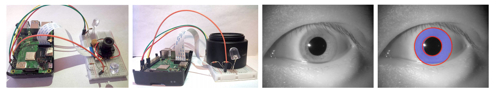

# RaspberryPiOpenSourceIris
Official Repo for IJCB 2020 Paper:

Open Source Iris Recognition Hardware and Software with Presentation Attack Detection ([https://arxiv.org/abs/2008.08220](https://arxiv.org/abs/2008.08220))<br/>
*Zhaoyuan Fang, Adam Czajka<br/>*



## Cite

If you find this repository useful for your research, please consider citing our work:

```
@article{fang2020osirishardsoft,
  title={Open Source Iris Recognition Hardware and Software with Presentation Attack Detection},
  author={Zhaoyuan Fang, Adam Czajka},
  journal={IEEE International Joint Conference on Biometrics (IJCB)},
  year={2020}
}
```

## Prerequisites
The code is written and tested with Python 3.5 and Raspberry Pi 3B+. The software can also be treated as an individual open-source method.<br/>
Required libraries: PyTorch, TensorFlow, OpenCV

## The NDIris3D Dataset
We are currently working on the release of this dataset.

## Software

### Iris Recognition
The iris recognition is adapted from [this paper](https://ieeexplore.ieee.org/abstract/document/8658238).

### OSPAD-2D and OSPAD-3D 
All source codes of the PAD methods are in the PAD folder. <br/>
References to the PAD methods can be found here: [OSPAD-2D](https://arxiv.org/abs/1809.10172) and [OSPAD-3D](https://arxiv.org/abs/1811.07252).

### CC-Net Segmentation
We apply [CC-Net](https://ieeexplore.ieee.org/abstract/document/8759448) for fast iris segmentation. All the codes are in the CCNet folder, as well as the segmentation model saved as a TensorFlow graph. Please check out CCNet/main.py for re-training / testing. The codes are straightforward to follow.

## Hardware Assembly Instructions
The required components include: Raspberry Pi (tested on 3B+), NIR-sensitive Pi-compatible camera, NIR filter, NIR LEDs, resistors and wires. Some requirements on the hardware are:<br/>
<ol>
<li/> The LEDs we used have emission wavelengths of 850nm, but any LED with emission wavelength between 700nm and 900nm would suffice.</li>
<li/> The NIR filter we used can be found here: https://www.amazon.com/gp/product/B07RNH1HNX/, but any NIR filter that cuts effectively the light below 700nm would work well.</li>
</ol>

The assembly steps are:<br/>
<ol>
<li/>Wire the left and right NIR LEDs to the output pins as specified in cfg/cfg.yaml. Connect them also with resistors to protect the circuit.</li>
<li/>Pile / assemble with a tube the NIR filter and camera. Place it in between the left and right LEDs.</li>
<li/>Adjust the angle of the LEDs; measure the updated angles and update in cfg/cfg.yaml OSPAD_3D settings.</li>
</ol>
